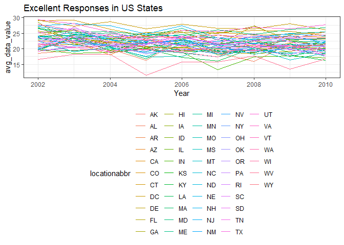
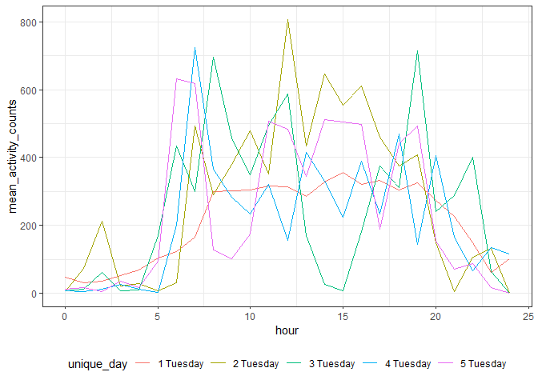

HW3
================
Maya Spaur
10/9/2019

\#Problem 1 Loading the
    data

``` r
library(tidyverse)
```

    ## -- Attaching packages ----------------------------------------------------------------------------- tidyverse 1.2.1 --

    ## v ggplot2 3.2.1     v purrr   0.3.2
    ## v tibble  2.1.3     v dplyr   0.8.3
    ## v tidyr   1.0.0     v stringr 1.4.0
    ## v readr   1.3.1     v forcats 0.4.0

    ## -- Conflicts -------------------------------------------------------------------------------- tidyverse_conflicts() --
    ## x dplyr::filter() masks stats::filter()
    ## x dplyr::lag()    masks stats::lag()

``` r
library(p8105.datasets)
library(viridis)
```

    ## Loading required package: viridisLite

``` r
theme_set(theme_bw() + theme(legend.position = "bottom"))


data("instacart")


instacart %>%
  group_by(aisle) %>%
  summarize(n= n()) %>%
  mutate(aisle_rank = rank(desc(n))) %>%
  filter(aisle_rank <=3)
```

    ## # A tibble: 3 x 3
    ##   aisle                           n aisle_rank
    ##   <chr>                       <int>      <dbl>
    ## 1 fresh fruits               150473          2
    ## 2 fresh vegetables           150609          1
    ## 3 packaged vegetables fruits  78493          3

Describing the data

The `Instacart` dataset has 1384617 observations and 15 variables. The
data is structured such that each row is a product from an order, and
there is one order per user of the Instacart Online Grocery Shopping
service. Key variables include order\_id (order identifier), product\_id
(product identifier), product\_name, and aisle. \[What does it mean,
give an illustrative example of observations –\> give example of first
item in table\]?

There are 134 unique types of aisles. The three most populare are fresh
fruits, fresh vegetables, and packaged vegetables fruits.

Plot with Number of Items per Aisle

``` r
Number_of_items = 
  instacart %>%
  group_by(aisle) %>%
  summarize(n= n()) %>%
  filter(n > 10000) %>%
  ggplot(aes(x = aisle, y = n)) + geom_col() + theme(axis.text.x = element_text(angle = 90)) + labs(x = "Aisle", y = "Number of Items Ordered", title = "Number of Items Ordered from Aisle")

Number_of_items
```

<!-- -->

Table with 3 Most Popular Items

``` r
baking_ingredients =
instacart %>%
  filter(aisle== "baking ingredients") %>%
  group_by(aisle, product_name) %>%
  summarize(n=n()) %>%
  arrange(desc(n)) %>%
  head(3)
  

dog_food_care =
  instacart %>%
  filter(aisle == "dog food care") %>%
  group_by(aisle, product_name) %>%
  summarize(n=n()) %>%
  arrange(desc(n)) %>%
  head(3)

packaged_vegetables_fruits =
  instacart %>%
  filter(aisle == "packaged vegetables fruits") %>%
  group_by(aisle, product_name) %>%
  summarize(n=n()) %>%
  arrange(desc(n)) %>%
  head(3)
         
binded_table = 
  rbind(baking_ingredients, dog_food_care, packaged_vegetables_fruits) %>%   knitr::kable()


binded_table
```

| aisle                      | product\_name                                 |    n |
| :------------------------- | :-------------------------------------------- | ---: |
| baking ingredients         | Light Brown Sugar                             |  499 |
| baking ingredients         | Pure Baking Soda                              |  387 |
| baking ingredients         | Cane Sugar                                    |  336 |
| dog food care              | Snack Sticks Chicken & Rice Recipe Dog Treats |   30 |
| dog food care              | Organix Chicken & Brown Rice Recipe           |   28 |
| dog food care              | Small Dog Biscuits                            |   26 |
| packaged vegetables fruits | Organic Baby Spinach                          | 9784 |
| packaged vegetables fruits | Organic Raspberries                           | 5546 |
| packaged vegetables fruits | Organic Blueberries                           | 4966 |

The most popular items in the aisle for baking\_ingredients were light
brown sugar, pure baking soda, and cane sugar. For the dog food care
aisle, the most popular items were snack sticks, organix chicken, and
small dog biscuits. In the packaged vegetables and fruits aisle, the
most popular items were organic baby spianch, organic raspberries, and
organic blueberries.

Time of Pink Lady Apples and Coffee Ice Cream Orders

``` r
instacart %>%
  janitor::clean_names() %>%
  filter(product_name == "Pink Lady Apples"| product_name == "Coffee Ice Cream") %>%
  group_by(order_dow, product_name) %>%
  summarize(
    mean_hour = mean(order_hour_of_day)
  ) %>%
  pivot_wider(
    names_from = "order_dow",
    values_from = "mean_hour"
  ) %>%
   knitr::kable(digits = 2)
```

| product\_name    |     0 |     1 |     2 |     3 |     4 |     5 |     6 |
| :--------------- | ----: | ----: | ----: | ----: | ----: | ----: | ----: |
| Coffee Ice Cream | 13.77 | 14.32 | 15.38 | 15.32 | 15.22 | 12.26 | 13.83 |
| Pink Lady Apples | 13.44 | 11.36 | 11.70 | 14.25 | 11.55 | 12.78 | 11.94 |

In comparing times of orders of Pink Lady Apples and Coffee Ice Cream,
averaged across hours of the day, Pink Lady Apples had consistently
fewer orders than Coffee Ice Cream for each day of the week.

\#Problem 2

Data Cleaning

``` r
data("brfss_smart2010")

brfss_smart2010 = 
  brfss_smart2010 %>%
  janitor::clean_names() %>%
  filter(topic == "Overall Health", response %in% c("Excellent", "Very good", "Good", "Fair", "Poor")) %>%
  mutate(
    response = as.factor(response),
    response = forcats::fct_relevel(response, c("Poor", "Fair", "Good", "Very good", "Excellent")))
```

Answering questions

``` r
brfss_smart2010 %>%
  janitor::clean_names() %>%
  filter(year == "2002") %>%
  group_by(locationabbr) %>%
  summarize(unique_location = length(unique(locationdesc))) %>%
              filter(unique_location >= 7)
```

    ## # A tibble: 6 x 2
    ##   locationabbr unique_location
    ##   <chr>                  <int>
    ## 1 CT                         7
    ## 2 FL                         7
    ## 3 MA                         8
    ## 4 NC                         7
    ## 5 NJ                         8
    ## 6 PA                        10

``` r
brfss_smart2010 %>%
  janitor::clean_names() %>%
  filter(year == "2010") %>%
  group_by(locationabbr) %>%
  summarize(unique_location = length(unique(locationdesc))) %>%
              filter(unique_location >= 7)
```

    ## # A tibble: 14 x 2
    ##    locationabbr unique_location
    ##    <chr>                  <int>
    ##  1 CA                        12
    ##  2 CO                         7
    ##  3 FL                        41
    ##  4 MA                         9
    ##  5 MD                        12
    ##  6 NC                        12
    ##  7 NE                        10
    ##  8 NJ                        19
    ##  9 NY                         9
    ## 10 OH                         8
    ## 11 PA                         7
    ## 12 SC                         7
    ## 13 TX                        16
    ## 14 WA                        10

In 2002, 6 states (CT, FL, MA, NC, NJ and PA) were observed at 7 or more
locations. In 2010, 14 states (CA, CO, FL, MA, MD, NC, NE, NJ, NY, OH,
PA, SC, TX and WA) were observed at over 7 or more locations.

Spaghetti Plot

``` r
spaghetti_plot = 
  brfss_smart2010 %>%
  janitor::clean_names() %>%
  filter(response == "Excellent") %>%
  group_by(locationabbr, year) %>%
  summarize(
    avg_data_value = mean(data_value)
  ) %>%
  select(year, locationabbr, avg_data_value) %>%
  ggplot(aes(x = year, y = avg_data_value, group = locationabbr, color = locationabbr)) + geom_line() + labs(title = "Excellent Responses in US States", x = "Year", Y = "Avg Data Value") 

spaghetti_plot
```

    ## Warning: Removed 3 rows containing missing values (geom_path).

<!-- -->

2 Panel Plot

``` r
Two_panel_plot =
brfss_smart2010 %>%
  janitor::clean_names() %>%
  filter(year== "2006" | year=="2010", locationabbr =="NY") %>%
  filter(topic == "Overall Health", response %in% c("Excellent", "Very good", "Good", "Fair", "Poor")) %>%
 ggplot(aes(x = response, y = data_value)) + geom_col() + facet_grid(~year) + labs(title = "Poor to Excellent Responses in NY State", x = "Response", Y = "Data Value")


Two_panel_plot
```

<!-- -->

\#Problem 3

Loading and tidying the data

``` r
accelerometer_data =
 read_csv("./accel_data.csv") %>%
  janitor::clean_names() %>%
 pivot_longer(
    activity_1:activity_1440,
    names_to = "minutes",
    names_prefix ="activity_",
    values_to = "activity_counts"
  ) %>%
    mutate(
    weekend = if_else(day == "Saturday" | day == "Sunday", "weekend", "weekday")
    ) %>%
  mutate(
    minutes = as.integer(minutes)
  )
```

    ## Parsed with column specification:
    ## cols(
    ##   .default = col_double(),
    ##   day = col_character()
    ## )

    ## See spec(...) for full column specifications.

``` r
accelerometer_data
```

    ## # A tibble: 50,400 x 6
    ##     week day_id day    minutes activity_counts weekend
    ##    <dbl>  <dbl> <chr>    <int>           <dbl> <chr>  
    ##  1     1      1 Friday       1            88.4 weekday
    ##  2     1      1 Friday       2            82.2 weekday
    ##  3     1      1 Friday       3            64.4 weekday
    ##  4     1      1 Friday       4            70.0 weekday
    ##  5     1      1 Friday       5            75.0 weekday
    ##  6     1      1 Friday       6            66.3 weekday
    ##  7     1      1 Friday       7            53.8 weekday
    ##  8     1      1 Friday       8            47.8 weekday
    ##  9     1      1 Friday       9            55.5 weekday
    ## 10     1      1 Friday      10            43.0 weekday
    ## # ... with 50,390 more rows

The `accelerometer_data` dataset has 50,400 observations and 6
variables. Data was collected on a male 63-year old patient disgnosed
with congestive heart failure and admitted to the Advanced Cardiac Care
Center of Columbia University Medical Center. Key variables include
day\_id (one day\_id corresponding to each of the 35 days of data
collection), day (day of the week), minutes, activity\_counts (total
activity for each minute of the day), and weekend (coded as weekend for
Saturday and Sunday, and weekday for Monday - Friday).

Total Activity of the Day

``` r
accelerometer_data2 =
accelerometer_data %>%
    group_by(day_id) %>%
  summarize(
    total_activity = sum(activity_counts))

  
accelerometer_data2 %>% knitr::kable()
```

| day\_id | total\_activity |
| ------: | --------------: |
|       1 |       480542.62 |
|       2 |        78828.07 |
|       3 |       376254.00 |
|       4 |       631105.00 |
|       5 |       355923.64 |
|       6 |       307094.24 |
|       7 |       340115.01 |
|       8 |       568839.00 |
|       9 |       295431.00 |
|      10 |       607175.00 |
|      11 |       422018.00 |
|      12 |       474048.00 |
|      13 |       423245.00 |
|      14 |       440962.00 |
|      15 |       467420.00 |
|      16 |       685910.00 |
|      17 |       382928.00 |
|      18 |       467052.00 |
|      19 |       371230.00 |
|      20 |       381507.00 |
|      21 |       468869.00 |
|      22 |       154049.00 |
|      23 |       409450.00 |
|      24 |         1440.00 |
|      25 |       260617.00 |
|      26 |       340291.00 |
|      27 |       319568.00 |
|      28 |       434460.00 |
|      29 |       620860.00 |
|      30 |       389080.00 |
|      31 |         1440.00 |
|      32 |       138421.00 |
|      33 |       549658.00 |
|      34 |       367824.00 |
|      35 |       445366.00 |

Total activity was shown to vary over day\_id. Levels seemed to
stabilize for a few days at a time, then would drop or increase
drastically.

Plots for Activity Counts

Mean Activity Count for each Unique Day

``` r
accelerometer_data3 =
accelerometer_data %>%
  mutate(
    hour = minutes %/% 60,
    hour = as.integer(hour),
    unique_day = paste(week, day)
  ) %>%
  group_by(unique_day, hour) %>%
  summarize(mean_activity_counts = mean(activity_counts))

accelerometer_plot =
accelerometer_data3 %>%
  ggplot(aes(x = hour, y = mean_activity_counts, color = unique_day)) + geom_line()

accelerometer_plot
```

<!-- -->

Mean Activity County for each day of the week for all 35 days over 5
weeks demonstrate the variability in accelerometer activity counts.
Broad trends include higher levels of activity from about hour 7 to hour
21, reflecting relatively normal waking hours.

``` r
accelerometer_data4=
accelerometer_data %>%
  mutate(
    hour = minutes %/% 60,
    hour = as.integer(hour),
  ) %>%
  group_by(day, hour) %>%
  summarize(mean_activity_counts = mean(activity_counts))

accelerometer_data4
```

    ## # A tibble: 175 x 3
    ## # Groups:   day [7]
    ##    day     hour mean_activity_counts
    ##    <chr>  <int>                <dbl>
    ##  1 Friday     0                 38.1
    ##  2 Friday     1                 25.0
    ##  3 Friday     2                 17.9
    ##  4 Friday     3                 37.3
    ##  5 Friday     4                 92.0
    ##  6 Friday     5                120. 
    ##  7 Friday     6                206. 
    ##  8 Friday     7                350. 
    ##  9 Friday     8                350. 
    ## 10 Friday     9                430. 
    ## # ... with 165 more rows

``` r
accelerometer_plot2 =
accelerometer_data4 %>%
  ggplot(aes(x = hour, y = mean_activity_counts, color = day)) + geom_line()

accelerometer_plot2
```

<!-- -->

Based on the plot above, mean activity counts for all days of the week
tend to increase from hour 5 to hour 10 or 10 and remain relatively
active during typical waking hours, until hour 20. Mean activity counts
tended to be lowest from hour 22 to hour 5, indicating sleeping.

Mean Activity Count for Tuesday

``` r
accelerometer_data5=
accelerometer_data %>%
  filter(day == "Tuesday") %>%
  mutate(
    hour = minutes %/% 60,
    hour = as.integer(hour),
    unique_day = paste(week, day)
  ) %>%
  group_by(unique_day, hour) %>%
  summarize(mean_activity_counts = mean(activity_counts))
  

accelerometer_data5
```

    ## # A tibble: 125 x 3
    ## # Groups:   unique_day [5]
    ##    unique_day  hour mean_activity_counts
    ##    <chr>      <int>                <dbl>
    ##  1 1 Tuesday      0                 46.1
    ##  2 1 Tuesday      1                 29.6
    ##  3 1 Tuesday      2                 34.9
    ##  4 1 Tuesday      3                 51.3
    ##  5 1 Tuesday      4                 69.3
    ##  6 1 Tuesday      5                104. 
    ##  7 1 Tuesday      6                122. 
    ##  8 1 Tuesday      7                166. 
    ##  9 1 Tuesday      8                299. 
    ## 10 1 Tuesday      9                303. 
    ## # ... with 115 more rows

``` r
accelerometer_plot3 =
accelerometer_data5 %>%
  ggplot(aes(x = hour, y = mean_activity_counts, color = unique_day)) + geom_line()

accelerometer_plot3
```

<!-- -->

Based on the graph of mean activity counts per hour on Tuesday, average
actvity increased steadily from approximately hour 5 to hour 7, remained
relatively active from hour 8 to hour 20 (daytime hours, with an
exception for Tuesday of week 3), and decreased to hour 24.
